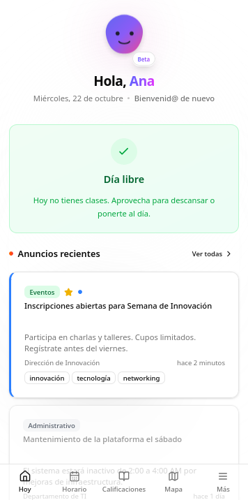
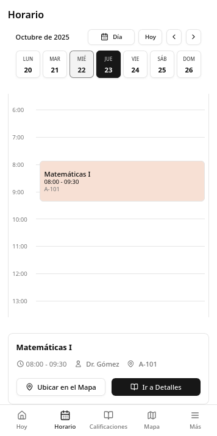
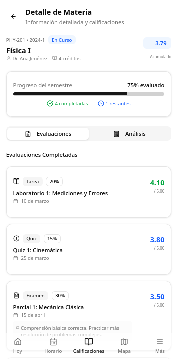
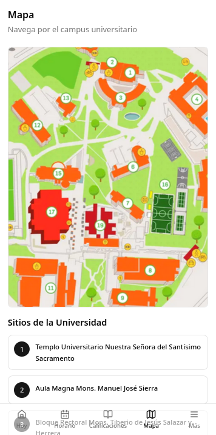

<h1 align="center">Ponti — Tu Compañero de Carrera Digital 🎓</h1>

<p align="center">
  <a href="https://pnpm.io/"></a>
  <a href="https://nextjs.org/"></a>
  
</p>

<p align="center">
  <b>Una aplicación web moderna pensada para estudiantes:</b> organiza tu vida académica, consulta calificaciones, revisa tu horario, recibe notificaciones y accede a servicios de bienestar desde una interfaz clara y amigable.
</p>

<br>
<table align="center">
  <tr>
    <td></td>
    <td></td>
    <td></td>
    <td></td>
  </tr>
</table>


## ✨ Características

<table>
  <tr>
    <td width="50%">
      <h3 align="center">🎯 Académico</h3>
      <ul>
        <li>🗓 <b>Horarios personalizados</b> y recordatorios</li>
        <li>🧾 <b>Calificaciones en tiempo real</b> y simulador de notas</li>
        <li>📚 Visualización de <b>plan de estudios</b> y progreso</li>
      </ul>
    </td>
    <td width="50%">
      <h3 align="center">🔔 Comunicación</h3>
      <ul>
        <li>📰 <b>Noticias</b> de interés estudiantil</li>
        <li>🔔 Sistema de <b>notificaciones</b> en tiempo real</li>
        <li>📢 <b>Anuncios importantes</b> y eventos</li>
      </ul>
    </td>
  </tr>
  <tr>
    <td width="50%">
      <h3 align="center">🧠 Bienestar</h3>
      <ul>
        <li>�‍♀️ <b>Mood tracker</b> y recomendaciones</li>
        <li>🏥 Acceso a <b>servicios de salud</b> y apoyo</li>
        <li>🧩 <b>Recursos</b> para balance vida-academia</li>
      </ul>
    </td>
    <td width="50%">
      <h3 align="center">🛠️ Herramientas</h3>
      <ul>
        <li>✨ <b>Onboarding interactivo</b> para nuevos usuarios</li>
        <li>🧰 Acceso a <b>servicios universitarios</b></li>
        <li>🗺️ <b>Mapa interactivo</b> del campus</li>
      </ul>
    </td>
  </tr>
</table>

## 📁 Estructura

<details open>
<summary><b>Estructura del proyecto</b></summary>
<br>

```bash
ponti-frontend/
├── src/
│   ├── app/             # Rutas y páginas (Next.js App Router)
│   ├── components/      # Componentes UI reutilizables
│   ├── data/            # Mocks y datos estáticos
│   ├── hooks/           # Custom hooks
│   ├── services/        # Interacción con APIs
│   ├── store/           # Estado global
│   └── utils/           # Utilidades y helpers
├── public/              # Assets estáticos
└── scripts/             # Scripts de ayuda para desarrollo
```

</details>

## 🚀 Tecnologías

<p align="center">
  <a href="https://nextjs.org/"></a>
  <a href="https://reactjs.org/"></a>
  <a href="https://www.typescriptlang.org/"></a>
  <a href="https://tailwindcss.com/"></a>
  <a href="https://pnpm.io/"></a>
</p>

## 🚦 Instalación

### Prerrequisitos

- Node.js 18.x o superior
- PNPM instalado globalmente

### Pasos para instalar

1. **Clonar el repositorio**

```bash
git clone https://github.com/Nekstoreo/Ponti.git
cd Ponti/ponti-frontend
```

2. **Instalar dependencias**

```bash
pnpm install
```

3. **Iniciar servidor de desarrollo**

```bash
pnpm dev
```

4. **Visitar la aplicación**

Abre [http://localhost:3000](http://localhost:3000) en tu navegador preferido.

## ⚙️ Comandos

| Comando      | Descripción                                          |
| ------------ | ---------------------------------------------------- |
| `pnpm dev`   | Inicia el servidor de desarrollo en `localhost:3000` |
| `pnpm build` | Genera una versión optimizada para producción        |
| `pnpm start` | Inicia la aplicación en modo producción              |
| `pnpm lint`  | Ejecuta el linter para verificar el código           |

## 🤝 Contacto y contribuciones

¿Quieres contribuir al proyecto o tienes alguna duda?

<p align="center">
  <a href="https://github.com/Nekstoreo/Ponti/issues/new?template=feature_request.md"></a>
  <a href="https://github.com/Nekstoreo/Ponti/issues/new?template=bug_report.md"></a>
</p>

<hr>

<p align="center">
  <b>¡Gracias por mirar Ponti!</b><br>
  Esperamos que te sea útil en tu vida universitaria. 🎓🚀<br><br>
  <a href="#"></a>
</p>
